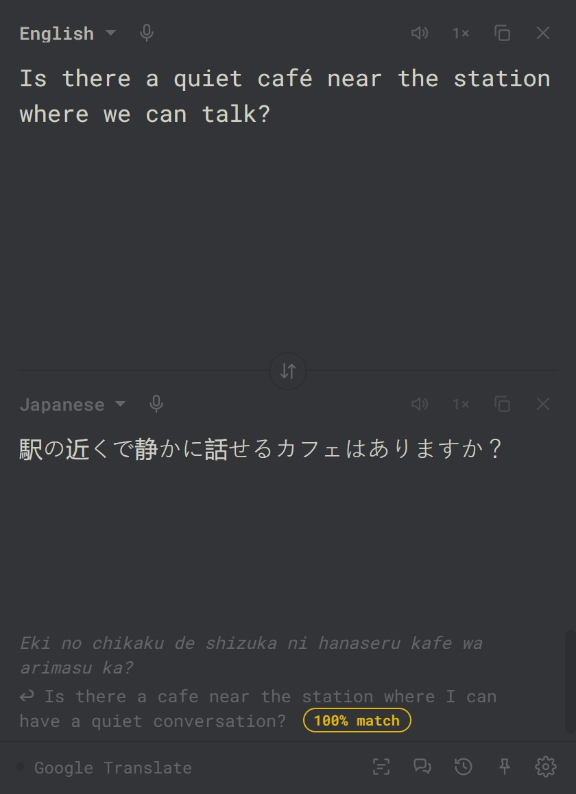
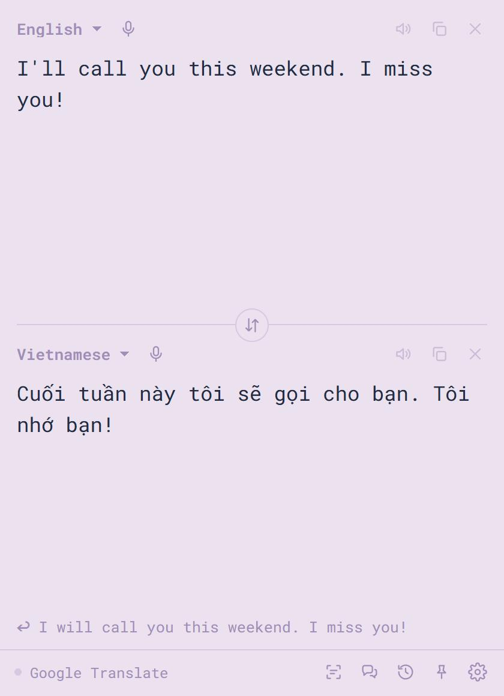

<p align="center"></p>

<h1 align="center">Vox2</h1>

<p align="center">A tiny two-way translator for your desktop.<br>
Type, paste, speak or snip text in any app and read it, or hear it, in another language.</p>

<p align="center"><a href="https://github.com/chrisqtruong/vox2/releases/latest/download/Vox2-setup.exe"><b>Download for Windows</b></a> · <a href="https://chrisqtruong.github.io/vox2">Website</a> · <a href="https://github.com/chrisqtruong/vox2/releases">Releases</a></p>

<p align="center">
  
  
</p>

## What it does

- **Live, both ways.** Type in either box and the other translates as you go. New words show grey until the engine settles.
- **From any app.** Select text anywhere and press <kbd>Ctrl</kbd>+<kbd>Alt</kbd>+<kbd>T</kbd>; the translation appears in a bubble by your cursor.
- **Snip & translate.** <kbd>Ctrl</kbd>+<kbd>Alt</kbd>+<kbd>S</kbd>, draw a box around text on screen (images, subtitles, apps that block copying), read it in your language.
- **Dictation.** Tap or hold <kbd>Right Ctrl</kbd> and talk. Transcribed on your machine; optionally typed into the app you're using, as said or translated.
- **Read aloud.** Natural male and female voices in about 75 languages. Each word lights up as it is spoken; slow (0.75×), normal and fast (1.25×) speeds and a volume slider, which take effect mid-sentence.
- **Conversation mode.** Two people take turns; each phrase is translated and spoken to the other.
- **Engines.** Google Translate (free), or Claude, ChatGPT or Gemini with your own key, with a tone setting and a "who it's for" note so pronouns come out right.
- **Back-translation with a match score.** See your translation turned back into your language, with a score for how much of your meaning survived (see below).
- Detect language, pinned languages, pronunciation for non-Latin scripts, 30-item history, always on top, 37 themes, self-updates.

## Back-Translation Fidelity Scoring

With **back-translation** on (settings → translation), Vox2 translates the result back into your language and shows it under the translation as a faint ↩ line, tagged with a score such as `92% match`. Hover the tag for a short key.

**What it measures.** How much of your meaning survived the round trip: your text → the translation → back into your language. Good translations often come back reworded ("Good morning" → "Good day"). Counting shared words would mark those as failures, so the score compares **meaning, not exact words**, using a sentence-embedding model.

### The method, exactly

Code: [`resources/meaning.js`](resources/meaning.js) (scoring) and [`resources/meaning-worker.js`](resources/meaning-worker.js) (model).

**Inputs.**

- **A**: the text you typed, trimmed.
- **B**: the back-translation. It always comes from Google Translate (`translate.googleapis.com`, `client=gtx`), whichever engine made the forward translation.

**1. Number formatting.** Thousands separators are removed from A and B so formatting doesn't count as a difference:
`(\d)[,.   ](?=\d{3}(?!\d))` → `$1`. For example, "1,000", "1.000" and "1 000" all become "1000".

**2. Exact-match shortcut.** Each text is normalized:

1. Unicode NFKC
2. `toLocaleLowerCase()`
3. every run of punctuation or symbols (`[\p{P}\p{S}]+`) replaced with a space
4. whitespace collapsed and trimmed

If the two results are equal, the score is **100** and the model isn't used.

**3. Meaning similarity.** A and B (after step 1, but *not* lowercased or stripped) are embedded with [`paraphrase-multilingual-MiniLM-L12-v2`](https://huggingface.co/sentence-transformers/paraphrase-multilingual-MiniLM-L12-v2):

- **Model:** 12 layers, 384 dimensions, 50+ languages, trained on paraphrase pairs.
- **Weights:** the 8-bit quantized ONNX export [`Xenova/paraphrase-multilingual-MiniLM-L12-v2`](https://huggingface.co/Xenova/paraphrase-multilingual-MiniLM-L12-v2), file `onnx/model_quantized.onnx` (118 MB).
- **Runtime:** [transformers.js](https://huggingface.co/docs/transformers.js) 4.3.0 on the CPU (WebAssembly), entirely on your computer.
- **Embedding:** mean pooling over tokens, then L2 normalization.

The similarity *c* is the cosine of the two vectors (their dot product, since both have length 1).

**4. Scale to a percentage.**

```
score = round( clamp( (c − 0.55) / (0.85 − 0.55), 0, 1 ) × 100 )
```

So *c* ≤ 0.55 scores 0, *c* ≥ 0.85 scores 100, and the range between is linear. The two thresholds were chosen from the test pairs below.

**5. Number check.** All numbers are extracted from A and B (`\d+(?:[.,]\d+)?`), sorted, and compared as lists. Sentence embeddings barely react to a changed digit, but a changed number is a real error. If the lists differ, the score is capped: `score = min(score, 60)`.

### Tiers

| Score | Tier | Meaning | Color |
|---|---|---|---|
| 85–100 | high | meaning kept | theme accent |
| 65–84 | moderate | check the details | theme muted |
| below 65 | low | likely off: something dropped, added, reversed or mistranslated | theme warning |

### Test pairs

These are the measurements the thresholds came from. *c* was measured in Vox2 with the quantized model.

| A | B | *c* | Score |
|---|---|---|---|
| Where is the bathroom? | Where is the toilet? | 0.845 | 98 |
| I am sorry I was late to your wedding. | Sorry for being late to the wedding. | 0.849 | 100 |
| Good morning, how are you? | Good day, how are you? | 0.814 | 88 |
| Good morning. | Good day. | 0.775 | 75 |
| I would like a table for two by the window. | I want a table for two people. | 0.833 | 94 |
| Please send me the report by Friday. | Please send the report to me on Monday. | 0.746 | 65 |
| My grandmother makes the best pho in Houston. | My grandmother makes the best pho. | 0.707 | 52 |
| It is raining cats and dogs. | Cats and dogs are falling. | 0.635 | 28 |
| I can come to the party. | I cannot come to the party. | 0.612 | 21 |
| The meeting was moved to next week. | The meeting was cancelled. | 0.438 | 0 |
| Mẹ ơi, con nhớ mẹ nhiều lắm. | Mẹ ơi, con nhớ mẹ rất nhiều. | 0.995 | 100 |
| Mẹ ơi, con nhớ mẹ nhiều lắm. | Mẹ ơi, con đói lắm. | 0.430 | 0 |
| Turn left at the second traffic light. | Turn right at the second traffic light. | 0.937 | 100 ✗ |
| He told me she was coming. | She told me he was coming. | 0.992 | 100 ✗ |

✗ = the score misses a real error (see limits below).

### Check it yourself

The same model in Python gives the same similarities to within about ±0.01. The small gap comes from quantization: Vox2 uses 8-bit weights.

```python
# pip install sentence-transformers
from sentence_transformers import SentenceTransformer

model = SentenceTransformer("sentence-transformers/paraphrase-multilingual-MiniLM-L12-v2")
a, b = model.encode(["Good morning, how are you?", "Good day, how are you?"], normalize_embeddings=True)
c = float(a @ b)
score = round(min(1, max(0, (c - 0.55) / 0.30)) * 100)
print(round(c, 3), score)  # ≈ 0.81, ≈ 88
```

Remember steps 1, 2 and 5 (number formatting, exact match, number cap) when comparing your results with the app's.

### Limits

- **A low score doesn't always mean a bad translation.** The mistake may have happened on the way *back* (always Google). Literal or free engines also drift more on the round trip than the AI engines (Claude, ChatGPT, Gemini).
- **Single swapped words can slip through.** Embeddings score left/right and he/she swaps as near-identical, as the ✗ rows show.
- **Idioms confuse it.** "Raining cats and dogs" vs "raining heavily" scores 54 even though the meaning matches.
- **The number is a hint, not proof.** Read the ↩ line, and use the number to spot what to look at.

### Next steps for the score

- When an AI engine is selected, optionally ask it to judge meaning preservation directly. That would catch swaps and idioms, but costs an API call.
- Compare your text against the translation itself with cross-lingual embeddings, which removes the Google back-translation step as a source of error.

## Shortcuts

| Keys | Action |
|---|---|
| <kbd>Ctrl</kbd>+<kbd>Shift</kbd>+<kbd>Space</kbd> | show / hide Vox2, ready to type |
| <kbd>Ctrl</kbd>+<kbd>Alt</kbd>+<kbd>T</kbd> | translate the selected text in any app |
| <kbd>Ctrl</kbd>+<kbd>Alt</kbd>+<kbd>S</kbd> | snip an area of the screen and translate it |
| <kbd>Right Ctrl</kbd> | dictate (tap, or hold to talk) |
| <kbd>Ctrl</kbd>+<kbd>P</kbd> | pin on top (while Vox2 is in front) |

All configurable in settings.

## Install

1. Download `Vox2-setup.exe` from the [latest release](https://github.com/chrisqtruong/vox2/releases/latest) and run it. It installs per user, no admin needed.
2. The installer isn't code-signed, so Windows shows "unknown publisher". Choose **More info → Run anyway**.
3. Vox2 updates itself from GitHub releases (signed updates). Switch to "ask me" or off in settings → window.

Windows 10/11, 64-bit. macOS can be built from the same code; not published yet.

## How it works

| Part | Tech |
|---|---|
| Shell | [Tauri 2](https://tauri.app): a ~5 MB Rust binary hosting the UI in the system web view (WebView2), no bundled browser |
| UI | plain HTML/CSS/JS in `resources/`, no framework or build step |
| Global shortcuts, typing into other apps, selection grab | Rust: `rdev` keyboard hook, `enigo` simulated input, `arboard` clipboard |
| Speech to text | Whisper (tiny/base/small) running locally via [transformers.js](https://huggingface.co/docs/transformers.js) + ONNX Runtime, WebGPU when available. Kept loaded after use for 2, 10 or 30 min depending on the computer's memory, and released early if memory runs low |
| Back-translation score | [paraphrase-multilingual-MiniLM-L12-v2](https://huggingface.co/sentence-transformers/paraphrase-multilingual-MiniLM-L12-v2) sentence embeddings via transformers.js, local; released from memory when idle |
| Screen text | `xcap` capture + [Tesseract.js](https://tesseract.projectnaptha.com) OCR, local |
| Voices | Microsoft neural voices (Edge Read Aloud protocol, `tts.rs`), OpenAI, or system voices |
| Translation | Google Translate web endpoint, or the Anthropic / OpenAI / Gemini APIs, called directly |
| Updates | `tauri-plugin-updater`, minisign-signed, served from GitHub releases |

## Privacy

- No account, no server, no analytics.
- Text goes only to the engine you choose. Voice, screen snips and the back-translation score are processed locally (models download once from Hugging Face).
- Settings and history are stored in your user profile. API keys are kept in the system credential store (Windows Credential Manager; the macOS Keychain on Mac), never in the settings file. Keys saved by versions before 0.4.6 are moved there automatically on first launch.
- The free Google Translate and Microsoft voice services are unofficial endpoints and may break; the API engines are the official route.

## Roadmap

Planned or being considered, roughly in order. Ideas and requests are welcome in [Issues](https://github.com/chrisqtruong/vox2/issues).

- [ ] **macOS version.** The same app built for Mac. API keys are already set up to use the Mac Keychain.
- [ ] **Mini mode.** A one-line bar version of the window to keep open while you work.
- [ ] **Smarter match score.** An optional check by the AI engine that catches swapped words (left/right, he/she) and idioms, and a direct comparison with the translation that skips the trip back. See [next steps for the score](#next-steps-for-the-score).
- [ ] **Better snip on "detect".** More accurate screen-text reading when the source language isn't set.
- [ ] **Code signing.** A verified publisher name on the installer, so Windows stops showing "unknown publisher". Planned once Vox2 has more users; until then, see [Install](#install).

## Build

```
cargo install tauri-cli --version "^2" --locked
cargo tauri build            # installer in src-tauri/target/release/bundle/nsis/
```

Needs Rust and, on Windows, the Visual Studio C++ build tools (on macOS, Xcode command-line tools). Release builds that publish updates also need the updater signing key in `TAURI_SIGNING_PRIVATE_KEY`.

Layout: `resources/` is the UI (`app.js` wires everything; `engines.js`, `dictation.js`, `tts.js`, `ocr.js`, `langpicker.js` are the pieces). `src-tauri/src/` is the native side (`main.rs`, `hotkey.rs`, `overlay.rs`, `tts.rs`).

## License

[GPL-3.0](LICENSE). Color themes are from [Monkeytype](https://github.com/monkeytypegame/monkeytype) (GPL-3.0). Fonts: Roboto Mono and Lexend Deca (SIL Open Font License).
