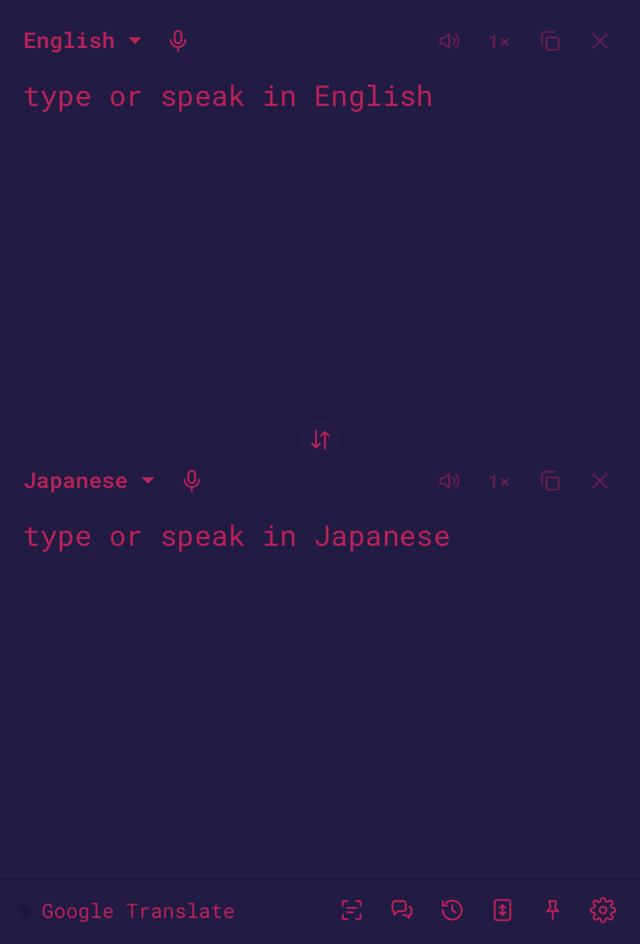
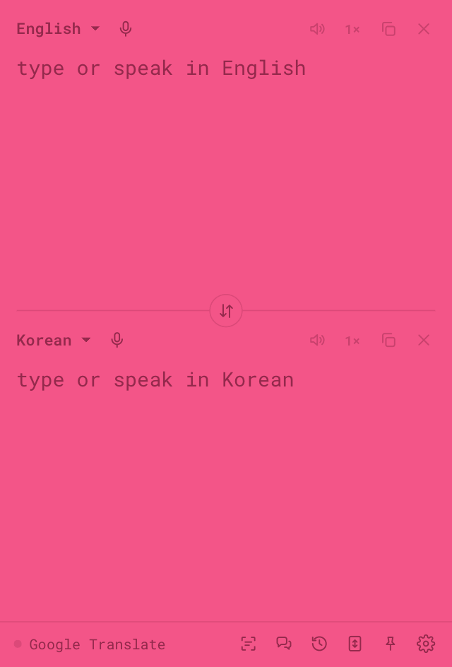

<p align="center"></p>

<h1 align="center">Vox2</h1>

<p align="center">A tiny two-way translator for your desktop.<br>
Type, paste, speak or snip text in any app and read it, or hear it, in another language.</p>

<p align="center"><a href="https://github.com/chrisqtruong/vox2/releases/latest/download/Vox2-setup.exe"><b>Download for Windows</b></a> · <a href="https://github.com/chrisqtruong/vox2/releases/latest/download/Vox2-mac.dmg"><b>Download for macOS</b></a> (beta) · <a href="https://chrisqtruong.github.io/vox2">Website</a> · <a href="https://github.com/chrisqtruong/vox2/releases">Releases</a></p>

<p align="center">
  
  
</p>

## Contents

- [What it does](#what-it-does)
- [Shortcuts](#shortcuts)
- [Conversation mode (beta)](#conversation-mode-beta)
- [Install](#install): [Windows](#windows) · [macOS](#macos-beta)
- [macOS notes](#macos-notes)
- [Back-translation and the meaning check](#back-translation-and-the-meaning-check)
- [How it works](#how-it-works)
- [Privacy](#privacy)
- [Roadmap](#roadmap)
- [Build](#build)
- [License](#license)
- [Changelog](CHANGELOG.md): what changed in each version

## What it does

- **Live, both ways.** Type in either box and the other translates as you go. New words show grey until the engine settles.
- **From any app.** Select text anywhere and press <kbd>Ctrl</kbd>+<kbd>Alt</kbd>+<kbd>T</kbd> (Mac: <kbd>⌥</kbd><kbd>⌘</kbd><kbd>T</kbd>); the translation appears in a bubble by your cursor.
- **Snip & translate.** <kbd>Ctrl</kbd>+<kbd>Alt</kbd>+<kbd>S</kbd> (Mac: <kbd>⌥</kbd><kbd>⌘</kbd><kbd>S</kbd>), draw a box around text on screen (images, subtitles, apps that block copying), read it in your language. On Mac, it's read by Apple's built-in text recognizer (the Live Text engine); on Windows, the snip is cleaned up first (enlarged, dark themes flipped, contrast boosted). Either way, screen text comes through word for word. The image stays in memory and is never saved.
- **Dictation.** Tap or hold <kbd>Right Ctrl</kbd> (Mac: <kbd>Right ⌥ Option</kbd>) and talk. Transcribed on your machine; optionally typed into the app you're using, as said or translated.
- **Read aloud.** Natural male and female voices in about 75 languages. Each word lights up as it is spoken; slow (0.75×), normal and fast (1.25×) speeds and a volume slider, which take effect mid-sentence. Press <kbd>Esc</kbd> in any app to stop it.
- **Conversation mode (beta).** Two people who speak different languages take turns through one computer; each phrase is translated and read aloud to the other. See [how it works and its limits](#conversation-mode-beta).
- **Engines.** Google Translate (free), or Claude, ChatGPT or Gemini with your own key. The AI engines add a tone setting (natural, casual, polite, formal) and a "who it's for" note so pronouns come out right (settings → translation; dimmed while Google Translate is selected).
- **Back-translation with a match score.** See your translation turned back into your language, with a score for how much of your meaning survived (see below). Theme colors by default, or colorblind-friendly colors with symbols (settings → appearance).
- Detect language, pinned languages, pronunciation for non-Latin scripts, 30-item history, always on top (fades while you work elsewhere), 37 themes (star your favorites to keep them on top), search in settings, self-updates.
- **Windows and Mac.** The same app on both; on Mac the shortcuts use ⌘ and ⌥, and a permissions screen walks you through what macOS asks for.

## Shortcuts

| Windows | Mac | Action |
|---|---|---|
| <kbd>Ctrl</kbd>+<kbd>Shift</kbd>+<kbd>Space</kbd> | <kbd>⇧</kbd><kbd>⌘</kbd><kbd>Space</kbd> | show / hide Vox2, ready to type |
| <kbd>Ctrl</kbd>+<kbd>Alt</kbd>+<kbd>T</kbd> | <kbd>⌥</kbd><kbd>⌘</kbd><kbd>T</kbd> | translate the selected text in any app |
| <kbd>Ctrl</kbd>+<kbd>Alt</kbd>+<kbd>S</kbd> | <kbd>⌥</kbd><kbd>⌘</kbd><kbd>S</kbd> | snip an area of the screen and translate it |
| <kbd>Right Ctrl</kbd> | <kbd>Right ⌥ Option</kbd> | dictate: tap to start (stops when you go quiet, or tap again), or hold to talk |
| <kbd>Esc</kbd> | <kbd>Esc</kbd> | stop reading aloud or dictating, from any app (does nothing otherwise) |
| <kbd>Ctrl</kbd>+<kbd>P</kbd> | <kbd>⌘</kbd><kbd>P</kbd> | pin on top (while Vox2 is in front) |
| <kbd>Ctrl</kbd>+<kbd>Shift</kbd>+<kbd>F</kbd> | <kbd>⇧</kbd><kbd>⌘</kbd><kbd>F</kbd> | fit the window to its text (while Vox2 is in front) |
| <kbd>Ctrl</kbd>+<kbd>H</kbd> | <kbd>⌘</kbd><kbd>Y</kbd> | open / close history (while Vox2 is in front) |
| <kbd>Ctrl</kbd>+<kbd>,</kbd> | <kbd>⌘</kbd><kbd>,</kbd> | open / close settings (while Vox2 is in front) |

All configurable in settings → shortcuts. Hover a button in the bottom bar to see its shortcut.

## Conversation mode (beta)

For talking with someone who speaks another language, with one computer between you.

**How it works today**

1. Put your language in one box and theirs in the other (say English on top, Vietnamese below), and turn on conversation mode with the speech-bubble button in the bottom bar. Both mic buttons light up.
2. **You** tap the mic on your side and speak. When you pause (or tap the mic again), Vox2 writes the translation in the other box and **reads it aloud** in their language.
3. **They** tap the mic on their side and answer. The translation is read aloud to you.
4. Repeat. Starting to talk stops any reading still in progress, and both sides stay on screen as a written record.

Tips: use the speakers, not headphones, and put the computer between you. For a natural pace, set settings → dictation → "after a tap, stop when quiet for" to 2 s. Turning conversation mode on also turns on dictation, which it needs.

**Limitations (why it's in beta)**

- **Every turn starts with a tap.** Each person has to tap their mic before speaking. That's fine at a desk, but awkward face to face, when you'd rather look at each other than at the screen.
- **One computer, one microphone.** It works best in a quiet room, with each person close enough to the mic.

**Where it's heading: hands-free turns.** After Vox2 reads a translation aloud, it starts listening on the other side by itself, walkie-talkie style, so a conversation flows without touching the computer after the first tap. Tracked in [#11](https://github.com/chrisqtruong/vox2/issues/11).

## Install

### Windows

1. Download [`Vox2-setup.exe`](https://github.com/chrisqtruong/vox2/releases/latest/download/Vox2-setup.exe) from the [latest release](https://github.com/chrisqtruong/vox2/releases/latest) and run it. It installs per user, no admin needed.
2. The installer isn't code-signed, so Windows shows "unknown publisher". Choose **More info → Run anyway**.
3. Vox2 updates itself from GitHub releases (signed updates). Switch to "ask me" or off in settings → window & updates.

Windows 10/11, 64-bit.

### macOS (beta)

1. Download [`Vox2-mac.dmg`](https://github.com/chrisqtruong/vox2/releases/latest/download/Vox2-mac.dmg), open it and drag **Vox2** into **Applications**.
2. Open Vox2. It isn't notarized by Apple yet, so the first time macOS says it can't verify the developer. Go to **System Settings → Privacy & Security**, scroll down and click **Open Anyway**. You only do this once.
3. Vox2 opens a **permissions** screen listing what macOS needs you to allow. Click **allow** on each row and switch Vox2 on in the System Settings page that opens; the rows tick off as you go, and **restart now** appears where macOS needs one. You can come back to it any time from settings → permissions.
4. Vox2 updates itself from GitHub releases, like on Windows, and keeps its permissions across updates.

Apple Silicon Macs (M1 and newer). Tested on macOS 26.

## macOS notes

**Permissions.** macOS asks for each of these separately; the permissions screen shows them all in one place.

| Permission | Used for |
|---|---|
| Input Monitoring | hearing your shortcuts while you're in other apps |
| Accessibility | typing what you dictate into other apps, copying the selected text to translate it |
| Screen Recording | snip & translate (only the area you box is read, on your Mac) |
| Microphone | dictation (only shown when dictation is on) |

**Why permissions survive updates.** Mac builds are signed with Vox2's own certificate (free, self-made; not Apple-issued). macOS remembers permissions per signature, so every update counts as the same app. Unsigned builds would lose their permissions on every update.

**Shortcuts look Mac-native.** Settings shows them the way the menu bar does (⌥⌘T), and the defaults use ⌘ and ⌥ instead of Ctrl and Alt.

**If a shortcut does nothing.** Check settings → permissions. If a row stays "needed" even though Vox2 looks switched on in System Settings, an old entry is in the way: select Vox2 there, remove it with **−**, add it again with **+**, then restart Vox2. To clear every Vox2 entry at once, run this in Terminal and allow them again:

```
tccutil reset All com.chris.translator
```

**Back-translation on Mac.** Google's back-translation service often refuses requests from Vox2 on Mac ("too many requests"), so on Mac the ↩ line and its score come from the same Google service as the main translation. Pronunciation (pinyin, romaji…) still comes from the back-translation service; if Google refuses at that moment, only that line is left out.

**Not yet on Mac.** Intel Macs, and Apple notarization (which would remove the "Open Anyway" step).

## Back-translation and the meaning check

With **back-translation** on (settings → translation), Vox2 translates the result back into your language and shows it under the translation as a faint ↩ line, tagged with a score such as `92% match`. Hover the tag for a short key.

**What it measures.** How much of your meaning survived the round trip: your text → the translation → back into your language. Good translations often come back reworded ("Good morning" → "Good day"). Counting shared words would mark those as failures, so the score compares **meaning, not exact words**, using a sentence-embedding model.

### Tiers

| Score | Tier | Meaning | Color |
|---|---|---|---|
| 85–100 | high | meaning kept | theme accent |
| 65–84 | moderate | check the details | theme text |
| below 65 | low | likely off: something dropped, added, reversed or mistranslated | theme warning |

**can't check** (no score) means part of your text came through untranslated (gibberish, a garbled snip, text already in the other language): the ↩ line just repeats it, so a score would mean nothing. The untranslated words are underlined.

With **colorblind-friendly colors** on (settings → appearance), the tiers use the [Okabe–Ito](https://jfly.uni-koeln.de/color/) colorblind-safe palette instead, plus a symbol, so the tier never depends on color alone: blue ✓ (high), amber ! (moderate), vermillion ✕ (low), in a darker shade on light themes.


**Targeted checks.** On top of the score, Vox2 compares your text with the ↩ line for meaning flips: a "not" that appeared or disappeared, he/she swapped, an opposite word, a changed day or month, part missing, a changed number. Any of these caps the score at 60, the word behind it is underlined in the ↩ line, and the hover card says what changed and which of your words didn't come back. (English for now.)

**How well it works.** Measured on translations into 11 languages with planted meaning errors ([test history](docs/meaning-check-tests/README.md#test-history)). On new, held-out sentences, it now catches **78% of meaning errors** (up from about 35% before the targeted checks) and still shows 93% of good translations as "meaning kept", with 5% false alarms ([run 3 report](docs/meaning-check-tests/2026-10-03-run-3.md)). Closing the remaining gap is at the top of the [roadmap](#roadmap).

**More:** [how the score is computed, exactly](docs/meaning-check-tests/README.md#how-the-score-works), [all test reports](docs/meaning-check-tests/README.md#test-history), and [how to re-run the test](tools/meaning-bench/README.md).

## How it works

| Part | Tech |
|---|---|
| Shell | [Tauri 2](https://tauri.app): a ~5 MB Rust binary hosting the UI in the system web view (WebView2 on Windows, WebKit on Mac), no bundled browser |
| UI | plain HTML/CSS/JS in `resources/`, no framework or build step |
| Global shortcuts, typing into other apps, selection grab | Rust: keyboard hook (`rdev` on Windows; on Mac a listen-only Core Graphics event tap in `hotkey.rs`), `enigo` simulated input, `arboard` clipboard |
| Mac permissions | `permissions.rs`: checks and prompts for Input Monitoring, Accessibility, Screen Recording and Microphone |
| Speech to text | Whisper (tiny/base/small) running locally via [transformers.js](https://huggingface.co/docs/transformers.js) + ONNX Runtime, WebGPU when available. Kept loaded after use for 2, 10 or 30 min depending on the computer's memory, and released early if memory runs low |
| Back-translation score | [paraphrase-multilingual-MiniLM-L12-v2](https://huggingface.co/sentence-transformers/paraphrase-multilingual-MiniLM-L12-v2) sentence embeddings via transformers.js, local; released from memory when idle |
| Screen text | `xcap` capture + [Tesseract.js](https://tesseract.projectnaptha.com) OCR, local |
| Voices | Microsoft neural voices (Edge Read Aloud protocol, `tts.rs`), OpenAI, or system voices |
| Translation | Google Translate web endpoint, or the Anthropic / OpenAI / Gemini APIs, called directly |
| Updates | `tauri-plugin-updater`, minisign-signed, served from GitHub releases. The Mac build is made by GitHub Actions when a release is published and added to the same release |

## Privacy

- No account, no server, no analytics.
- Text goes only to the engine you choose. Voice, screen snips and the back-translation score are processed locally (models download once from Hugging Face).
- Settings and history are stored in your user profile. API keys are kept in the system credential store (Windows Credential Manager; the macOS Keychain on Mac), never in the settings file. Keys saved by versions before 0.4.6 are moved there automatically on first launch.
- The free Google Translate and Microsoft voice services are unofficial endpoints and may break; the API engines are the official route.

## Roadmap

Ordered by value for the effort, highest first: what makes Vox2 more trustworthy and useful day to day comes before bigger projects and paid certificates. Each item has an issue for discussion, all under the [roadmap label](https://github.com/chrisqtruong/vox2/issues?q=label%3Aroadmap). Ideas and requests are welcome in [Issues](https://github.com/chrisqtruong/vox2/issues). Tags: value · effort · platforms.

1. **Meaning check: sharpen the targeted checks.** Shipped: Phase 1 and 1.1 (errors caught ~35% → 78%, false alarms back to 5%, [run 3](docs/meaning-check-tests/2026-10-03-run-3.md)). Next: more number words, *un-…-able* negations, honest handling of he/she in languages that don't mark it, word lists beyond English. *High · small · both.* ([#28](https://github.com/chrisqtruong/vox2/issues/28))
2. **Meaning check: show what changed.** Started: the words behind a flag are underlined in the ↩ line, and the hover card lists your words that didn't come back. Next: highlight added content too. *High · small · both.* ([#27](https://github.com/chrisqtruong/vox2/issues/27))
3. **Explain this** (AI-assisted). Select a phrase and ask what it *really* means: slang, idioms, how formal or rude it is, cultural context, how a native speaker would say it. *High · small · both.* ([#21](https://github.com/chrisqtruong/vox2/issues/21))
4. **Personal glossary** (AI-assisted). Names and terms that always come out your way: family names and nicknames, work terms, preferred words. *Medium-high · small · both.* ([#23](https://github.com/chrisqtruong/vox2/issues/23))
5. **Reply helper** (AI-assisted). After translating a message, write your answer in your language and get it back in theirs, in your tone and "who it's for", checked by the meaning check before you send. *High · medium · both.* ([#22](https://github.com/chrisqtruong/vox2/issues/22))
6. **Meaning check: AI double-check** (AI-assisted). Optionally ask the AI engine to compare meanings and list differences; the most accurate check, but it costs a request. *High · medium · both.* ([#7](https://github.com/chrisqtruong/vox2/issues/7))
7. **Meaning check: translate back with a different engine**, so one engine can't agree with its own mistake. *Medium · small · both.* ([#29](https://github.com/chrisqtruong/vox2/issues/29))
8. **Hands-free conversation.** After a translation is read aloud, Vox2 starts listening on the other side by itself, so a face-to-face conversation flows without touching the computer. See [conversation mode](#conversation-mode-beta). *Medium-high · medium · both.* ([#11](https://github.com/chrisqtruong/vox2/issues/11))
9. **Better snip.** More accurate screen-text reading, especially when the source language isn't set. On Mac, switch to Apple's built-in text reader (the Live Text engine), which reads screen text better than Tesseract and works offline. *Medium · medium · both.* ([#8](https://github.com/chrisqtruong/vox2/issues/8))
10. **Live call translation** (AI-assisted, bigger). On a video call, Vox2 listens to the computer's audio, transcribes it on your computer and shows live translated captions; if both people use Vox2, each reads the other in their own language. In phases: captions in the window, then a floating caption bar, then both directions. Optional and off by default. *Very high · large · both.* ([#24](https://github.com/chrisqtruong/vox2/issues/24))
11. **Mini mode.** A one-line bar version of the window to keep open while you work. *Medium · medium · both.* ([#6](https://github.com/chrisqtruong/vox2/issues/6))
12. **Mac: Intel support and Apple notarization.** Notarization removes the "Open Anyway" step on first launch ($99/year Apple Developer account). *Medium · small + cost · Mac.* ([#5](https://github.com/chrisqtruong/vox2/issues/5))
13. **Windows code signing.** A verified publisher name on the installer, so Windows stops showing "unknown publisher". Planned once Vox2 has more users; until then, see [Install](#install). *Medium · small + cost · Windows.* ([#9](https://github.com/chrisqtruong/vox2/issues/9))

Done: **macOS version** (beta), see [macOS notes](#macos-notes). **Meaning check says "can't check"** instead of 100% when text came through untranslated ([#38](https://github.com/chrisqtruong/vox2/issues/38)).

## Build

```
cargo install tauri-cli --version "^2" --locked
cargo tauri build            # installer in src-tauri/target/release/bundle/nsis/
```

Needs Rust and, on Windows, the Visual Studio C++ build tools (on macOS, Xcode command-line tools). Release builds that publish updates also need the updater signing key in `TAURI_SIGNING_PRIVATE_KEY`.

**Mac builds** come from GitHub Actions (`.github/workflows/build.yml`): run the **build** workflow by hand for a test `.dmg`. **Releases** (Windows + Mac together) come from the **release** workflow (Actions → release → Run workflow), so they can be made from any computer; publishing a release made on a PC also makes `build.yml` attach `Vox2-mac.dmg` and the Mac update to it. Signing uses repo secrets: `APPLE_CERTIFICATE`, `APPLE_CERTIFICATE_PASSWORD` and `APPLE_SIGNING_IDENTITY` (Vox2's own certificate), plus `TAURI_SIGNING_PRIVATE_KEY` for updates.

Layout: `resources/` is the UI (`app.js` wires everything; `engines.js`, `dictation.js`, `tts.js`, `ocr.js`, `langpicker.js` are the pieces). `src-tauri/src/` is the native side (`main.rs`, `hotkey.rs`, `overlay.rs`, `permissions.rs`, `tts.rs`).

## License

[GPL-3.0](LICENSE). Color themes are from [Monkeytype](https://github.com/monkeytypegame/monkeytype) (GPL-3.0). Turtle and rabbit icons are from [Lucide](https://lucide.dev) (ISC). Fonts: Roboto Mono and Lexend Deca (SIL Open Font License).
