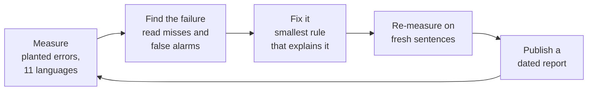
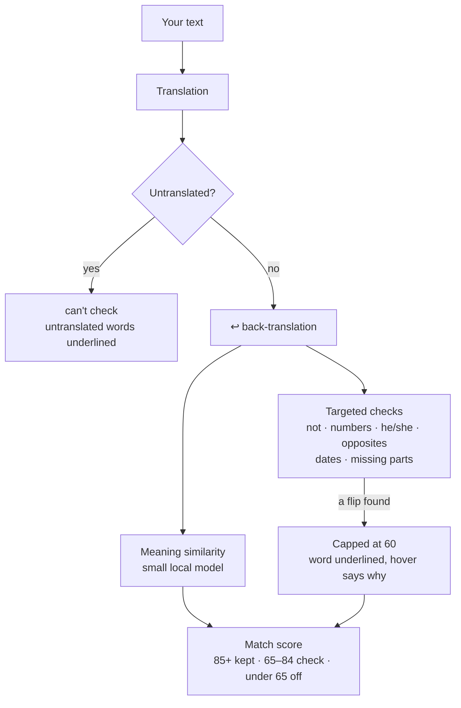
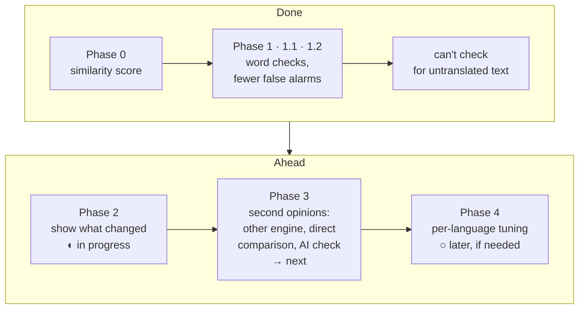
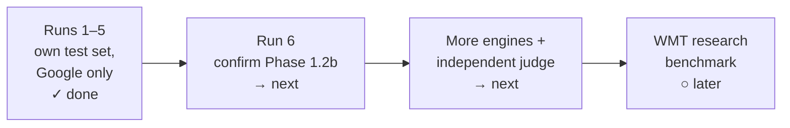
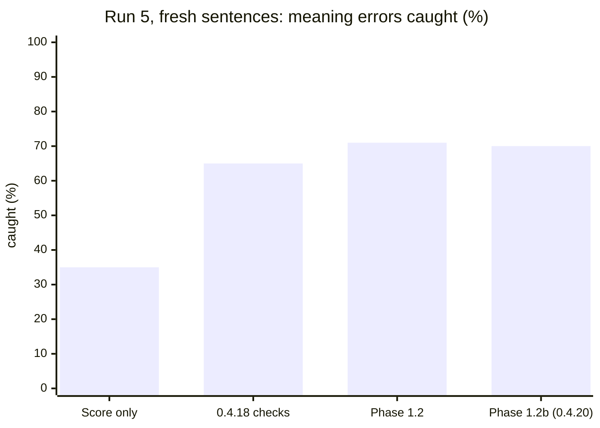

# The Meaning Check: know your translation came out right

When you translate something that matters (a message to family, a doctor's instructions, a work email) you usually can't read the result. Vox2's **Meaning Check** tells you whether your meaning made it through: it translates the result back into your language (the faint ↩ line), compares that with what you wrote, and shows a **match score** (`92% match`), underlines what changed, and says **can't check** when it honestly can't tell.

This page is the home of that work: the goal, where we are, what's next, how the score works, and a dated record of every test.

- [North star](#north-star)
- [What we're doing, in plain words](#what-were-doing-in-plain-words)
- [How a check runs](#how-a-check-runs)
- [Where we are](#where-we-are)
- [What's next](#whats-next)
- [Test history](#test-history)
- [How the score works](#how-the-score-works)
- [Re-running the test](#re-running-the-test)

## North star

> **Vox2 should be the translator you can trust: on the cutting edge, dependable, and instant. After every translation, you know whether your meaning came through, and when Vox2 can't tell, it says so instead of guessing.**

Four commitments, and how we hold ourselves to them:

| Commitment | What it means | How we measure it | Now (fresh sentences, [run 5](2026-10-04-run-5.md)) | Goal |
|---|---|---|---|---|
| **Trustworthy** | Real meaning errors get flagged; a "meaning kept" can be believed | Planted meaning errors caught, on sentences the checks were never tuned on | **70%** (was 35% before the checks) | **90%+** |
| **Dependable** | Good translations aren't cried wolf on; no fake confidence | False alarms on good translations; untranslated text shown as "meaning kept" | **6.9%** false alarms; gibberish shown as "meaning kept" **8%** (was 96%, [run 4](2026-10-04-run-4.md)) | **under 5%**; **never** confident about text that wasn't translated |
| **Responsive and light** | Instant translation; the check never slows it down or needs a big download | Runs on your computer with a small model; the score arrives after the translation, never before it | 118 MB model, local, unloads when idle; no extra servers | Same footprint; heavier checks only as opt-in add-ons |
| **Open and teachable** | Anyone can see how it works, check our numbers, and learn from it | Every change ships with a dated, reproducible report | Every phase reported below, raw results included | Keep it that way |

"Cutting edge" means measuring ourselves against the research state of the art (translation *quality estimation*, e.g. COMET-Kiwi, xCOMET, the WMT shared tasks), not just against our own previous runs. That comparison is planned ([#50](https://github.com/chrisqtruong/vox2/issues/50)).

## What we're doing, in plain words

**It isn't model training.** Vox2 uses a small, ready-made language model ([MiniLM](#how-the-score-works)) exactly as published. What we do is **evaluation and calibration**, the field researchers call *translation quality estimation*:

1. **Measure.** Take real sentences ([FLORES-200](https://github.com/facebookresearch/flores), 11 languages), plant meaning errors in copies of them (a "not" added, a number changed, he ↔ she, an opposite word, part dropped), translate everything, and see how often the Meaning Check catches the bad ones and leaves the good ones alone.
2. **Find the failure.** Read the misses and the false alarms: *why* did it get this one wrong?
3. **Fix it** with the smallest thing that explains it: a word check, a threshold, a rule for when to say "can't check".
4. **Re-measure on fresh sentences** (a *held-out set*) nobody looked at while fixing. Otherwise we'd be grading the student on the practice questions.



**Words used on this page**

| Term | Meaning |
|---|---|
| ↩ line, back-translation | The translation translated back into your language |
| Match score | 0–100: how much of your meaning survived the round trip (85+ meaning kept · 65–84 check the details · below 65 likely off) |
| Targeted checks | Word-level checks for flips the score misses ("not", numbers, he/she, opposites, dates, missing parts) |
| Error caught | A translation with a planted error that did **not** get "meaning kept" |
| False alarm | A good translation flagged "likely off" |
| Held-out / fresh set | Test sentences not used while designing the change |

## How a check runs



## Where we are

The work runs on two tracks: **phases** (what the Meaning Check can do) and **testing** (how sure we are about the numbers). ✓ done · ◐ in progress · → next · ○ later.

**What it can do** (phases):



**How sure we are** (testing track):



**What each step bought** (planted meaning errors caught on held-out sentences; Google both ways):

| Step | Shipped in | Errors caught | False alarms | Report |
|---|---|---|---|---|
| Phase 0: similarity score only | up to 0.4.14 | 29% | 4% | [run 1](2026-10-03.md) |
| Phase 1: word checks (not, numbers, he/she, opposites, dates, missing) | 0.4.15 | **78%** | 7% | [run 2](2026-10-03-run-2.md) |
| Phase 1.1: fewer false alarms, more opposites, first highlights | 0.4.15 | 78% | **5%** | [run 3](2026-10-03-run-3.md) |
| "can't check" for untranslated text | 0.4.18 | gibberish shown as "meaning kept": 96% → **8%** | 0 of 6,160 good ones affected | [report](2026-10-04-untranslated.md), [run 4](2026-10-04-run-4.md) |
| Phase 1.2 / 1.2b: numbers, more "not" words, inclusive pronouns | 0.4.20 | **70%** on a fresh set | 6.9% | [phase 1.2](2026-10-04-phase-1-2.md), [run 5](2026-10-04-run-5.md) |

**An honest note on the numbers.** Run 5 used brand-new sentences and a sixth error type (a gender added that you didn't write), and every version scored lower there than on its own earlier test: the 0.4.18 checks caught 65% instead of 78%. Earlier sets had been read while tuning, so they flattered us a little. Run 5 is the truest picture so far, and on the same fresh translations each step still helped:



**Strongest today:** dropped parts of a sentence (98%), changed numbers (94%), a "not" added or removed (85%). **Weakest:** opposite words (58%), swapped pronouns (44%), a gender added (40%). Most of those misses happen because the error is lost on the way out or smoothed over on the way back, so the ↩ line never shows it. Fixing that needs a second opinion, which is Phase 3.

## What's next

In order:

1. **Confirm Phase 1.2b on a second fresh set** (run 6), so today's numbers aren't tuned to run 5.
2. **Finish Phase 2: show what changed** ([#27](https://github.com/chrisqtruong/vox2/issues/27)). Today the word behind a flag is underlined and missing words are listed; next is highlighting added content too.
3. **Test against more engines and an independent judge** ([#52](https://github.com/chrisqtruong/vox2/issues/52)): DeepL, Microsoft Translator, Apple's on-device translator and an AI engine, forward and back, with a research judge (COMET-Kiwi or an AI judge) and native-speaker spot checks (Vietnamese first). Every test so far uses Google for everything, one engine grading itself.
4. **Phase 3: second opinions**, chosen by what step 3 shows:
   - translate back with a **different engine** than the one that translated ([#29](https://github.com/chrisqtruong/vox2/issues/29));
   - compare your text with the translation **directly** (the same local model reads both languages), so errors that vanish on the way back still show;
   - an optional **AI double-check** that lists what differs ([#7](https://github.com/chrisqtruong/vox2/issues/7)), and **suggested fixes, verified** before they're shown ([#55](https://github.com/chrisqtruong/vox2/issues/55)).
5. **Benchmark against the research state of the art** on the WMT human-annotated test sets ([#50](https://github.com/chrisqtruong/vox2/issues/50)), with an honest write-up of where Vox2 falls short.
6. **Phase 4: per-language tuning**, only if the numbers still differ a lot by language after Phase 3.

Light core, optional extras: anything heavier than today's small local model (an AI check, a big research model) stays opt-in.

## Test history

Each run has a dated report (what was tested, how, results, what we noticed, grades) and its raw results. Compare runs here; read a report for details.

| Date | Report | Method | Good shown as "meaning kept" | False alarms | Meaning errors caught | Missed | Overall |
|---|---|---|---|---|---|---|---|
| 2026-10-03 | [Run 1, baseline](2026-10-03.md) | 40 FLORES-200 sentences × 11 languages, 5 planted error types, Google both ways; Vox2 0.4.12 | 93% | 4% | 29% (numbers 100%, others 5–18%) | 71% | **F** on errors. Confirms good translations well; misses most meaning errors except numbers |
| 2026-10-03 | [Run 2, Phase 1 checks](2026-10-03-run-2.md) | Same method; **80 held-out sentences** (reported here) + run 1's 40 as development set; both methods scored on the same translations; Vox2 0.4.13 + targeted checks | 91% (run-1 method 95%) | 7% (3%) | **78%** (34%): negation 83%, number 98%, pronoun 70%, dropped clause 72%, opposite 66% | 22% (66%) | **C** on errors. Errors caught more than doubled in every language; a few more false alarms |
| 2026-10-03 | [Run 3, Phase 1.1](2026-10-03-run-3.md) | Same method; **fresh 80 held-out sentences** (none from runs 1–2); run 1, Phase 1 and Phase 1.1 scored on the same translations; Vox2 0.4.14 + false-alarm fixes, ~90 opposite pairs, highlights | 93% (Phase 1 91%, run 1 93%) | 5% (8%, 4%) | **78%** (78%, 39%): number 100%, negation 84%, dropped clause 82%, opposite 78%, pronoun 49% | 22% (22%, 61%) | **C** on errors. Same catches as Phase 1, false alarms back near baseline; pronouns weakest |
| 2026-10-04 | [Untranslated text](2026-10-04-untranslated.md) | Targeted test: all 6,160 good translations from runs 1–3, plus 324 garbled sentences (6 languages) translated by Google; Vox2 0.4.17 + "can't check" rule | unchanged (rule fired on 0 good translations) | +0 | **untranslated text: 84%** (half garbled), **94%** (all garbage) shown as "can't check" instead of a score | — | Fixes the "100% match" on gibberish / garbled snips |
| 2026-10-04 | [Run 4, untranslated text: bigger test](2026-10-04-run-4.md) | Independent test of the 0.4.18 check: 480 untranslatable texts (gibberish, garbled snips, half garbled, made-up words) from run 3's sentences + 30 name-heavy sentences, **all 11 languages**, Google both ways; plus a two-level alternative. Not comparable with the planted-error columns | 100% of good translations unaffected (two-level: 99.5%) | 0 of 6,160 (two-level: 0.4–0.5% capped at 84) | Held-out "meaning kept": gibberish 96% → **8%**, fully garbled 48% → **6%**, half garbled 54% → **35%** (two-level: 6%, 2%, **20%**); names 98% → 98% | – | **A** on gibberish and full garble, **D** on half-garbled (two-level: B). Weak spot for both: Hindi (spelled out phonetically) |
| 2026-10-04 | [Phase 1.2: numbers, "not" words, inclusive pronouns](2026-10-04-phase-1-2.md) | **Offline re-score** of runs 2–3's saved translations (no new Google requests), 0.4.18 checks vs Phase 1.2 on the same pairs. Held-out sets had been read before, so optimistic for new text | run 3: 93% → **94%** (run 2: 93% → 94%) | run 3: 4.8% → **4.1%** (run 2: 4.6% → **3.5%**) | run 3: 78% → **79%** (run 2: 77% → 77%) | 21% | **C** on errors. Fewer false alarms in every language; they/xe → he/she and partner → wife now flagged; pronouns marked uncheckable in Tagalog, Hindi, Urdu, Spanish |
| 2026-10-04 | [Run 5, fresh held-out; Phase 1.2b](2026-10-04-run-5.md) | **Fresh 96 held-out sentences** (none used before) + same 40 development; adds a 6th error type, **gender added** (they → he, people → men); run 1, 0.4.18, Phase 1.2 and Phase 1.2b on the same translations. 1.2b was designed after looking at this run | 93% / 91% / 90% / **91%** | 5.0% / 7.1% / 8.3% / **6.9%** | 35% / 65% / 71% / **70%**: negation 85%, number 94%, dropped clause 98%, opposite 58%, pronoun 44%, gender added 9% → **40%** | 30% | **C** on errors. Phase 1.2 raised false alarms on new text; 1.2b fixes it. Earlier phases score lower on fresh text too |

When you add a run, keep the same columns. If the method changed (more languages, new error types, different engines), say how in the Method column so rows stay comparable.

## How the score works

### The method, exactly

Code: [`resources/meaning.js`](../../resources/meaning.js) (scoring) and [`resources/meaning-worker.js`](../../resources/meaning-worker.js) (model).

**Inputs.**

- **A**: the text you typed, trimmed.
- **B**: the back-translation. It always comes from Google Translate (`translate.googleapis.com`, `client=gtx`), whichever engine made the forward translation.

**0. Untranslated text.** Before scoring, the *translation* is checked for text that came through untranslated (gibberish, a garbled snip, text already in the other language), which would otherwise come back unchanged and score ~100%. A stretch of the translation copied word for word from A (lowercase words count 1, capitalized ½, 6+ to fire), or 80%+ of A's words (4+ words) appearing in it, means **can't check**: no score, the copied words underlined. Code: `untranslated()` in [`resources/meaning-checks.js`](../../resources/meaning-checks.js); test: [2026-10-04](2026-10-04-untranslated.md).

**1. Number formatting.** Thousands separators are removed from A and B so formatting doesn't count as a difference:
`(\d)[,.   ](?=\d{3}(?!\d))` → `$1`. For example, "1,000", "1.000" and "1 000" all become "1000".

**2. Exact-match shortcut.** Each text is normalized:

1. Unicode NFKC
2. `toLocaleLowerCase()`
3. every run of punctuation or symbols (`[\p{P}\p{S}]+`) replaced with a space
4. whitespace collapsed and trimmed

If the two results are equal, the score is **100** and the model isn't used.

**3. Meaning similarity.** A and B (after step 1, but *not* lowercased or stripped) are embedded with [`paraphrase-multilingual-MiniLM-L12-v2`](https://huggingface.co/sentence-transformers/paraphrase-multilingual-MiniLM-L12-v2):

- **Model:** 12 layers, 384 dimensions, 50+ languages, trained on paraphrase pairs.
- **Weights:** the 8-bit quantized ONNX export [`Xenova/paraphrase-multilingual-MiniLM-L12-v2`](https://huggingface.co/Xenova/paraphrase-multilingual-MiniLM-L12-v2), file `onnx/model_quantized.onnx` (118 MB).
- **Runtime:** [transformers.js](https://huggingface.co/docs/transformers.js) 4.3.0 on the CPU (WebAssembly), entirely on your computer.
- **Embedding:** mean pooling over tokens, then L2 normalization.

The similarity *c* is the cosine of the two vectors (their dot product, since both have length 1).

**4. Scale to a percentage.**

```
score = round( clamp( (c − 0.55) / (0.85 − 0.55), 0, 1 ) × 100 )
```

So *c* ≤ 0.55 scores 0, *c* ≥ 0.85 scores 100, and the range between is linear. The two thresholds were chosen from the test pairs below.

**5. Number check.** All numbers are extracted from A and B (`\d+(?:[.,]\d+)?`), sorted, and compared as lists. Sentence embeddings barely react to a changed digit, but a changed number is a real error. If the lists differ, the score is capped: `score = min(score, 60)`.

### Test pairs

These are the measurements the thresholds came from. *c* was measured in Vox2 with the quantized model.

| A | B | *c* | Score |
|---|---|---|---|
| Where is the bathroom? | Where is the toilet? | 0.845 | 98 |
| I am sorry I was late to your wedding. | Sorry for being late to the wedding. | 0.849 | 100 |
| Good morning, how are you? | Good day, how are you? | 0.814 | 88 |
| Good morning. | Good day. | 0.775 | 75 |
| I would like a table for two by the window. | I want a table for two people. | 0.833 | 94 |
| Please send me the report by Friday. | Please send the report to me on Monday. | 0.746 | 65 |
| My grandmother makes the best pho in Houston. | My grandmother makes the best pho. | 0.707 | 52 |
| It is raining cats and dogs. | Cats and dogs are falling. | 0.635 | 28 |
| I can come to the party. | I cannot come to the party. | 0.612 | 21 |
| The meeting was moved to next week. | The meeting was cancelled. | 0.438 | 0 |
| Mẹ ơi, con nhớ mẹ nhiều lắm. | Mẹ ơi, con nhớ mẹ rất nhiều. | 0.995 | 100 |
| Mẹ ơi, con nhớ mẹ nhiều lắm. | Mẹ ơi, con đói lắm. | 0.430 | 0 |
| Turn left at the second traffic light. | Turn right at the second traffic light. | 0.937 | 100 ✗ |
| He told me she was coming. | She told me he was coming. | 0.992 | 100 ✗ |

✗ = the score misses a real error (see limits below).

### Check it yourself

The same model in Python gives the same similarities to within about ±0.01. The small gap comes from quantization: Vox2 uses 8-bit weights.

```python
# pip install sentence-transformers
from sentence_transformers import SentenceTransformer

model = SentenceTransformer("sentence-transformers/paraphrase-multilingual-MiniLM-L12-v2")
a, b = model.encode(["Good morning, how are you?", "Good day, how are you?"], normalize_embeddings=True)
c = float(a @ b)
score = round(min(1, max(0, (c - 0.55) / 0.30)) * 100)
print(round(c, 3), score)  # ≈ 0.81, ≈ 88
```

Remember steps 1, 2 and 5 (number formatting, exact match, number cap) when comparing your results with the app's.

### Limits

- **A low score doesn't always mean a bad translation.** The mistake may have happened on the way *back* (always Google). Literal or free engines also drift more on the round trip than the AI engines (Claude, ChatGPT, Gemini).
- **Single swapped words can slip through.** Embeddings score left/right and he/she swaps as near-identical, as the ✗ rows show.
- **Idioms confuse it.** "Raining cats and dogs" vs "raining heavily" scores 54 even though the meaning matches.
- **The number is a hint, not proof.** Read the ↩ line, and use the number to spot what to look at.

### Targeted checks (Phase 1, from run 2)

On top of the similarity score, `resources/meaning-checks.js` compares your text with the ↩ line for meaning flips the score barely notices: a negation appearing or disappearing, he/she swapped, an opposite word, a changed month or weekday, and a ↩ line under 60% as long as your text (part missing). Number words count as numbers ("two" = 2). Any of these caps the score at 60 ("check the details"), the word behind it is underlined in the ↩ line, and the hover card says what changed and lists your words that didn't come back. Word lists are English for now. Details and measurements: [run 2](2026-10-03-run-2.md), [run 3](2026-10-03-run-3.md).

**Phase 1.2b** ([run 5](2026-10-04-run-5.md)): built negative words (unharmed, treeless, immoral) only cancel a plain "not" on the other side; they never raise a flag by themselves. A gendered word for a neutral one only counts when your text states no gender.

**Phase 1.2** ([report](2026-10-04-phase-1-2.md)): numbers written differently match (eighteenth = 18th, 90°F = 32°C, "340 and 500 million", "both" = two, conversions in brackets); more "not" words (unharmed, treeless, immoral…) and phrases that aren't negations ("not long ago", "No. 9"); pronouns are inclusive: singular *they* and neopronouns count, a he/she appearing where you wrote they/xe/ze, or a gendered word for a neutral one (partner → wife), caps the score; a neopronoun that comes back as "they" keeps it below 85. In Tagalog, Hindi, Urdu and Spanish, where pronouns can't survive the round trip, the hover card says pronouns can't be checked.

### Next steps for the score

See [What's next](#whats-next) at the top of this page.

## Re-running the test

The test kit is in [`tools/meaning-bench/`](../../tools/meaning-bench/) with step-by-step instructions. It uses Vox2's real scoring code and a fixed set of sentences, so a new run is directly comparable with the history above.
